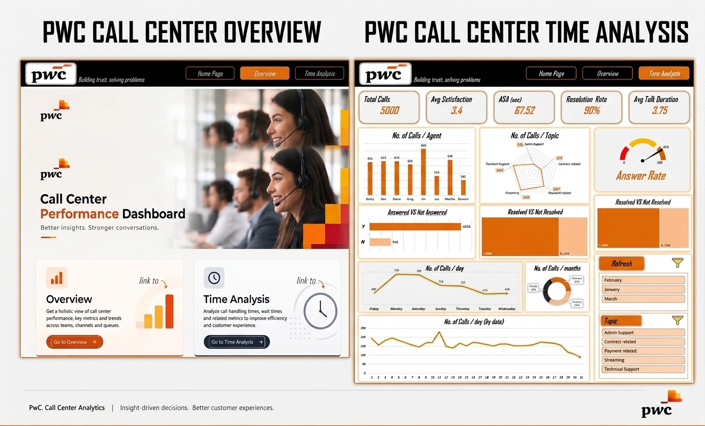
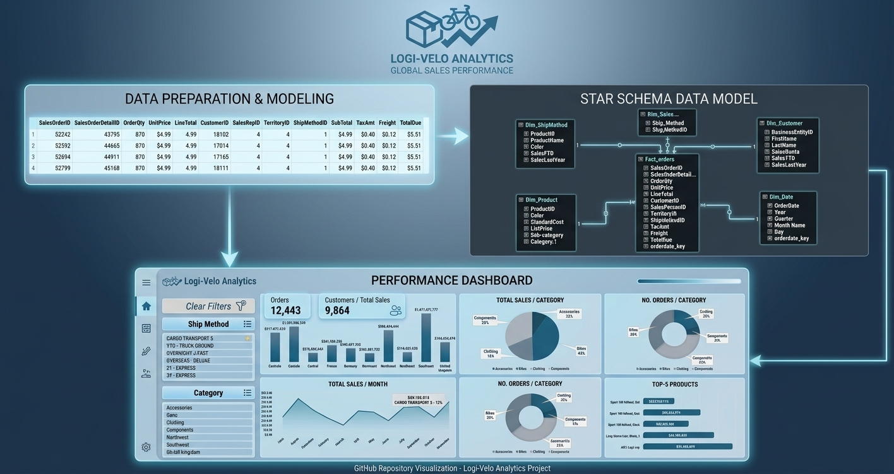

# 📊 Excel Analytics Portfolio

Interactive business dashboards built with **Microsoft Excel** and **Power Pivot** — transforming raw data into clear insights.

---

## 🗂️ Projects

### 01 · 📞 Call Center Performance Dashboard
> *PwC-styled | Excel + Slicers*

Multi-page dashboard tracking call center KPIs across agents, topics, and time.

| Metric | Value |
|---|---|
| Total Calls | 5,000 |
| Resolution Rate | 90% |
| Answer Rate | 81% |
| Avg Satisfaction | 3.4 / 5 |

**Pages:** Home · Overview · Time Analysis  

**Filters:** Month · Topic  

📁 [`Pwc_Project/`](./Pwc_Project)

---

### 02 · 📦 Logi-Velo Global Sales Performance
> *Star Schema | Excel + Power Pivot | 121,317 rows*

Single-page sales dashboard with a full data model covering territories, products, and shipping.

| Metric | Value |
|---|---|
| Total Orders | 12,443 |
| Total Sales | $1,319,298,360 |
| Customers | 9,864 |
| Top Order | $187,488 |

**Data Model:** Fact_orders + 5 dimension tables  

**Filters:** Territory · Category · Ship Method  

📁 [`02_LogiVelo_SalesDashboard/`](./Sales_Project)

---

### 03 · 🔮 Coming Soon
> *Next project in progress...*

---

## 🛠️ Stack

`Microsoft Excel` · `Power Pivot` · `DAX` · `Star Schema` · `PivotCharts` · `Slicers`

## ⚙️ Requirements

- Excel 2016 / 2019 / 365 on **Windows**
- Enable macros on open for full interactivity

---

*⭐ Star the repo if you find it useful!*
