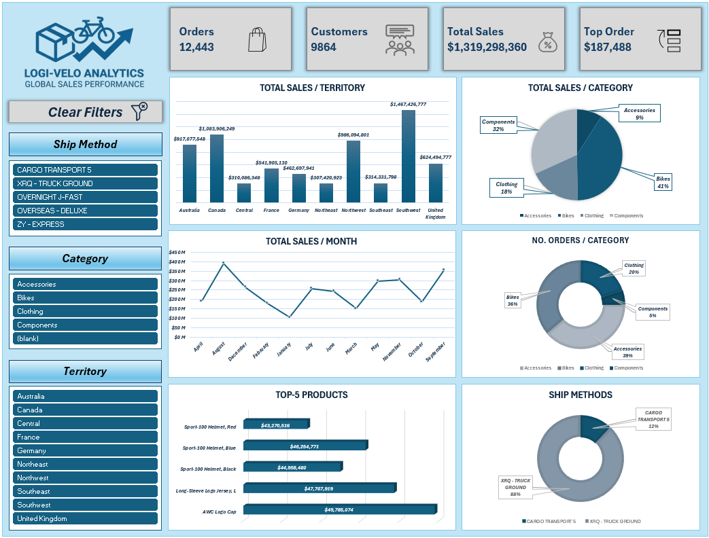
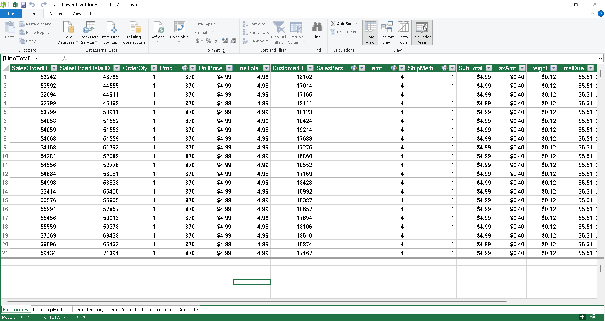
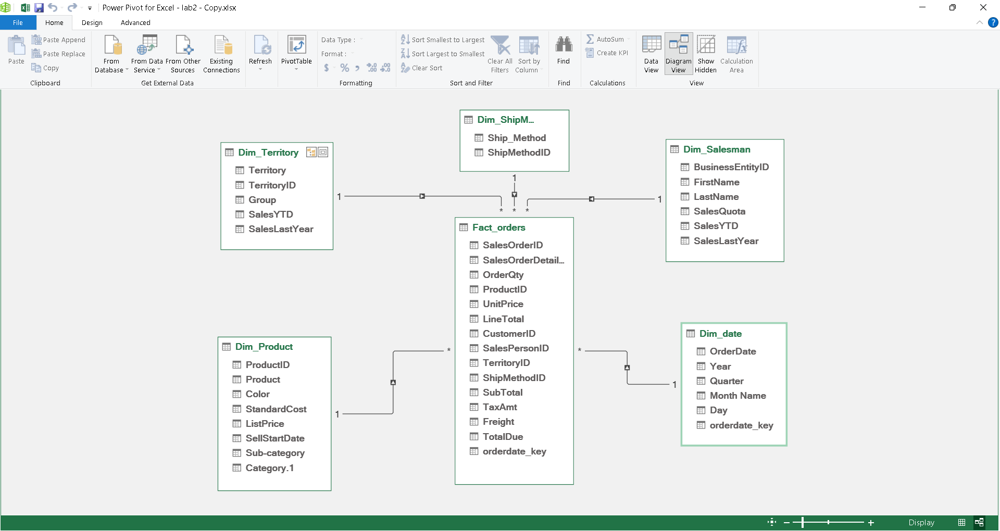

# 📦🚲 Global Sales Performance Dashboard

> **Built with Microsoft Excel + Power Pivot**  
> *Global Sales Performance | Data-Driven Decisions*

---

## Project Overview

**Logi-Velo Analytics** is an interactive Excel-based sales performance dashboard powered by **Power Pivot** and a **Star Schema** data model. It enables business analysts and sales managers to monitor global sales KPIs, explore product and territory performance, and drill into order trends across time — all from within Excel.

The dashboard covers:
- **12,443** orders across **10 territories**
- **9,864** unique customers
- **$1.3B+** in total sales
- Product categories: Accessories, Bikes, Clothing, Components


## Screenshots

### Dashboard


### Data in Power Pivot


### Data Model (Star Schema)


---

## Data Model (Power Pivot)

### Star Schema

The data model follows a **Star Schema** design with one central fact table connected to five dimension tables.

```
                    Dim_ShipMethod
                         |
                         | 1
                         |
Dim_Territory ——1——— Fact_orders ———*——— Dim_date
                         |
                   1 ——— | ——— 1
                   |           |
            Dim_Product    Dim_Salesman
```

> `Fact_orders` sits at the center with **121,317 records** and connects to all dimension tables via foreign keys.

---

### Tables & Columns

#### 📋 Fact_orders *(121,317 rows)*

| Column | Description |
|---|---|
| SalesOrderID | Unique order identifier |
| SalesOrderDetailID | Order line-item identifier |
| OrderQty | Quantity ordered |
| ProductID | FK → Dim_Product |
| UnitPrice | Price per unit |
| LineTotal | Line-level revenue (calculated) |
| CustomerID | Customer reference |
| SalesPersonID | FK → Dim_Salesman |
| TerritoryID | FK → Dim_Territory |
| ShipMethodID | FK → Dim_ShipMethod |
| SubTotal | Order subtotal |
| TaxAmt | Tax amount |
| Freight | Shipping cost |
| TotalDue | Total amount due |
| orderdate_key | FK → Dim_date |

---

#### 🌍 Dim_Territory

| Column | Description |
|---|---|
| TerritoryID | Primary key |
| Territory | Territory name |
| Group | Regional group |
| SalesYTD | Year-to-date sales |
| SalesLastYear | Prior year sales |

---

#### 🚚 Dim_ShipMethod

| Column | Description |
|---|---|
| ShipMethodID | Primary key |
| Ship_Method | Shipping method name |

---

#### 📦 Dim_Product

| Column | Description |
|---|---|
| ProductID | Primary key |
| Product | Product name |
| Color | Product color |
| StandardCost | Cost to produce |
| ListPrice | Retail list price |
| SellStartDate | Date product became available |
| Sub-category | Product sub-category |
| Category.1 | Top-level product category |

---

#### 👤 Dim_Salesman

| Column | Description |
|---|---|
| BusinessEntityID | Primary key |
| FirstName | Salesperson first name |
| LastName | Salesperson last name |
| SalesQuota | Assigned sales quota |
| SalesYTD | Year-to-date sales |
| SalesLastYear | Prior year sales |

---

#### 📅 Dim_date

| Column | Description |
|---|---|
| orderdate_key | Primary key (date key) |
| OrderDate | Full date of the order |
| Year | Calendar year |
| Quarter | Calendar quarter |
| Month Name | Month name (January–December) |
| Day | Day of month |

---

### Relationships

| From (Fact) | To (Dimension) | Cardinality |
|---|---|---|
| Fact_orders.TerritoryID | Dim_Territory.TerritoryID | Many → One |
| Fact_orders.ShipMethodID | Dim_ShipMethod.ShipMethodID | Many → One |
| Fact_orders.ProductID | Dim_Product.ProductID | Many → One |
| Fact_orders.SalesPersonID | Dim_Salesman.BusinessEntityID | Many → One |
| Fact_orders.orderdate_key | Dim_date.orderdate_key | Many → One |

---

## File Structure

```
📁 Logi-Velo-Analytics/
│
├── 📊 Sales_Dashboard.xlsx                  # Main Excel file (dashboard + Power Pivot)
│
├── 📁 Screenshots/
│   ├── dashboard.png                    # Dashboard screenshot
│   ├── Data_in_PowerPivot.png           # Power Pivot data view
│   └── DataModel_PowerPivot.png         # Power Pivot diagram (star schema)
│
└── 📄 README.md                         # This file
